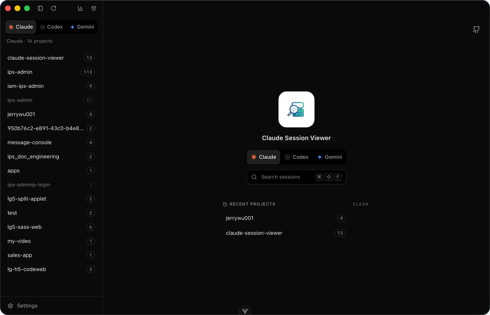
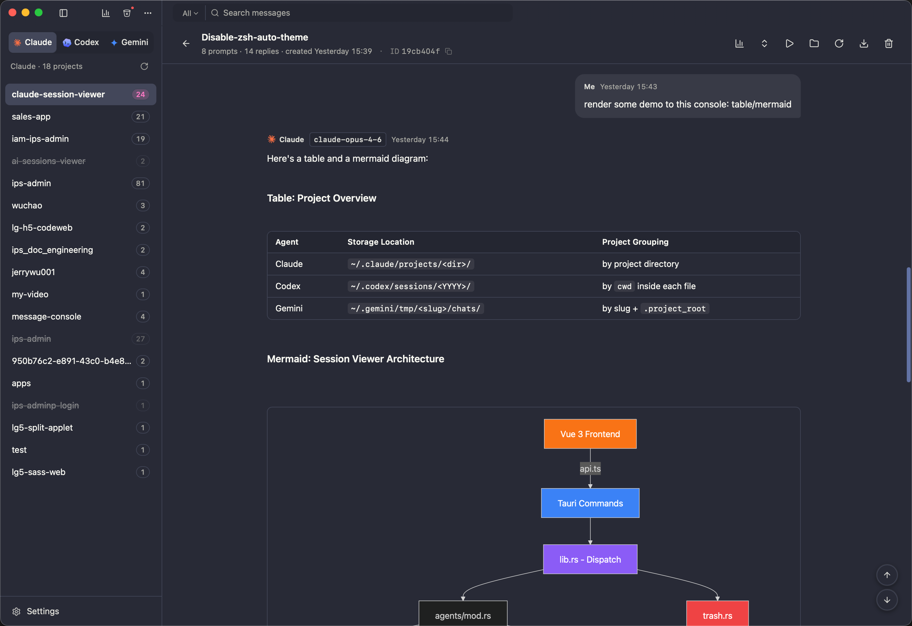
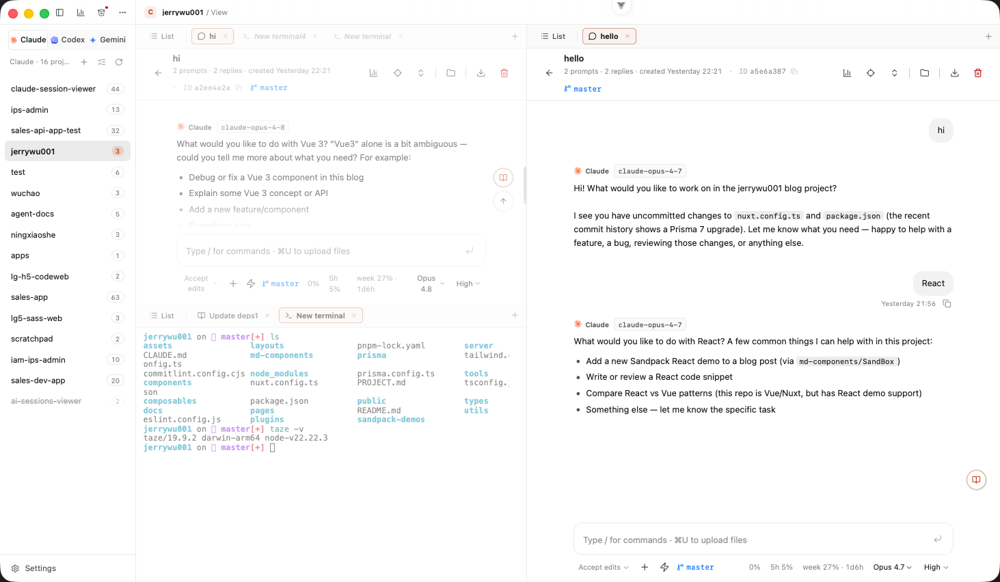
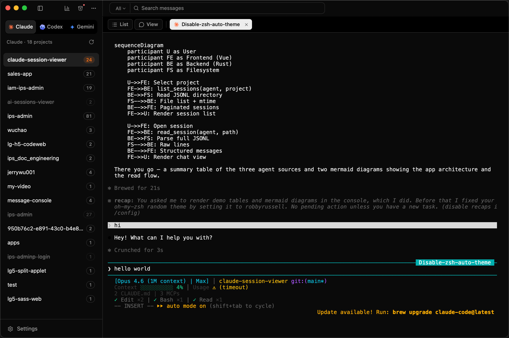
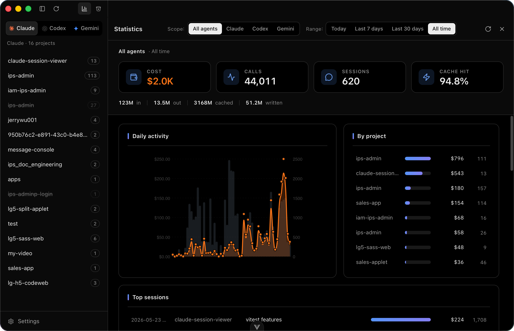
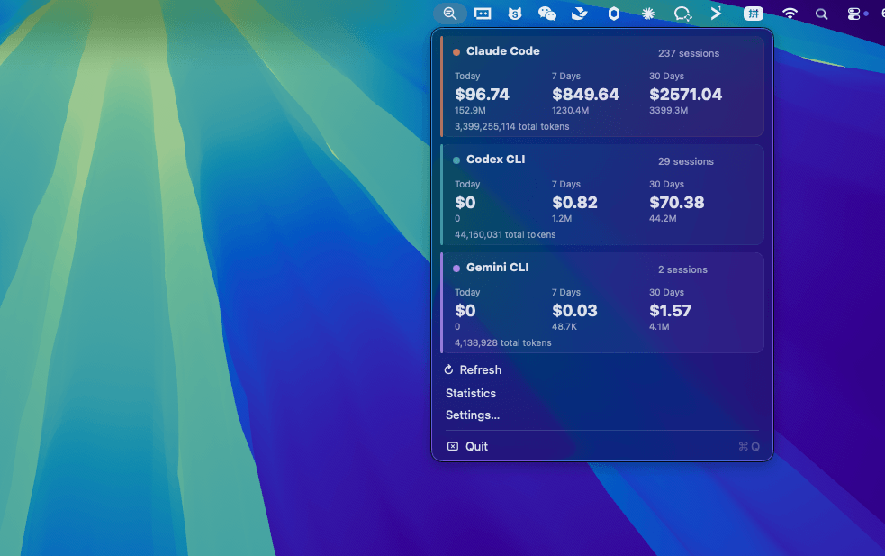
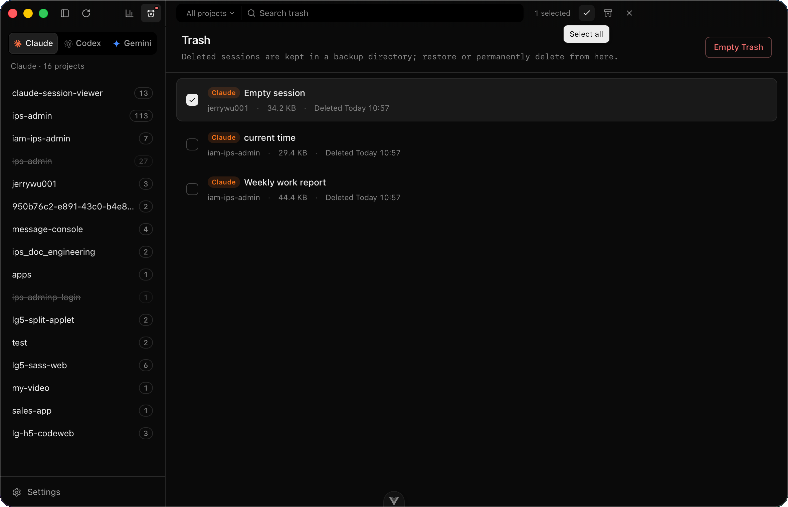
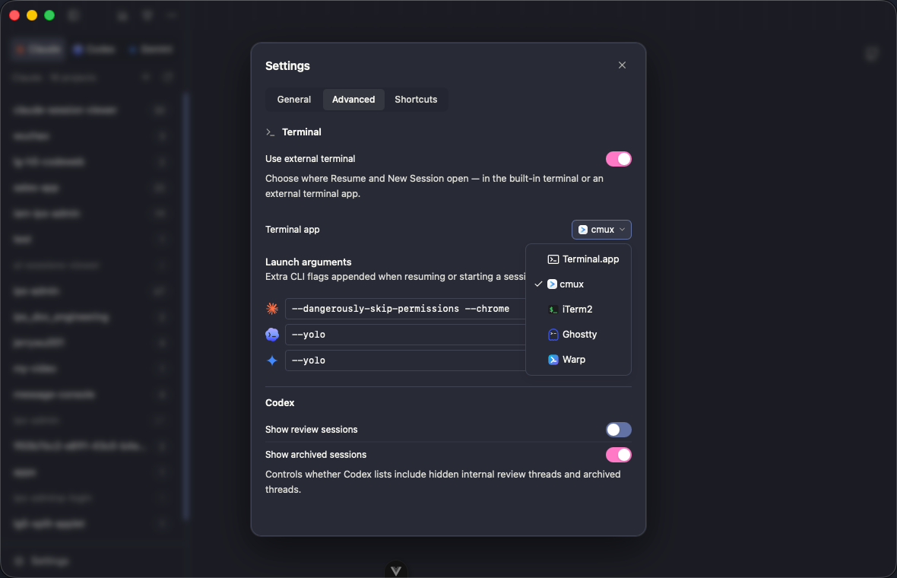
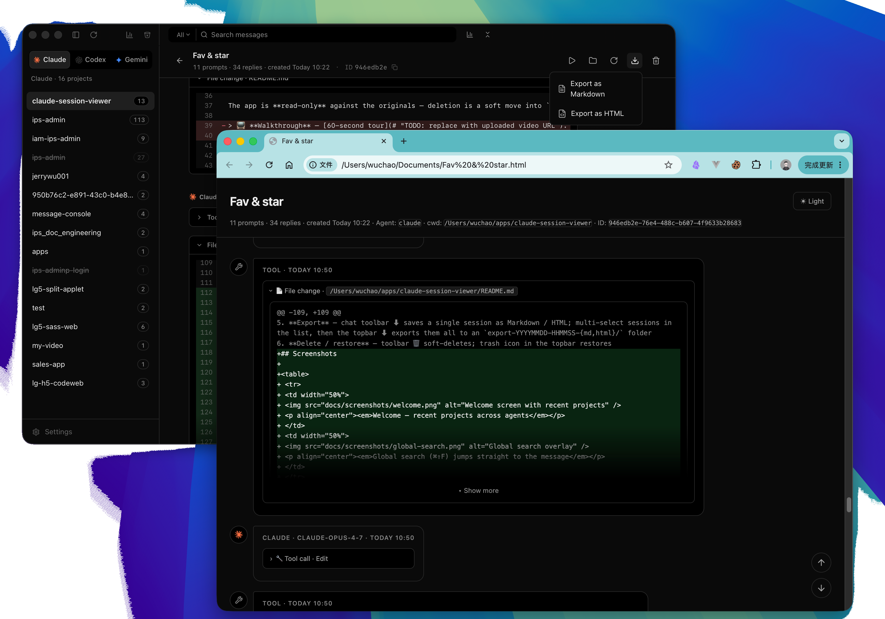

<div align="center">

# Claude Session Viewer

[](https://github.com/jerrywu001/cc-sessions-viewer/releases)
[](https://github.com/jerrywu001/cc-sessions-viewer/releases)
[](https://tauri.app/)
[](https://github.com/jerrywu001/cc-sessions-viewer/releases/latest)
[](https://vuejs.org)
[](LICENSE)

**English** · [中文](README.zh-CN.md) · [日本語](README.ja.md) · [CHANGELOG](CHANGELOG.md)

<p align="center">A native desktop browser for <strong>Claude Code</strong>, <strong>Codex</strong>, and <strong>Gemini CLI</strong>.<br/>Read, search, and manage local session transcripts from all three in one place.</p>

</div>

https://github.com/user-attachments/assets/9bcb92a8-e5b8-40e5-b492-af252162309b

---

## Key Features

- **Faithful replay** — thinking chains, tool-call pairings, structured diffs, and inline screenshots
- **Global search** — cross-project instant search (⌘⇧F) jumps to the exact message
- **In-app chat** — start or resume a session in a built-in chat with live model, reasoning-effort (incl. Opus **Ultracode**), and permission-mode pickers — no terminal required
- **One-click resume** — resume or start a session in an embedded terminal or external app — supports **Terminal.app**, **cmux**, **iTerm2**, **Ghostty**, and **Warp**
- **Shell terminal tabs** — open pure shell tabs alongside agent sessions for running arbitrary commands in the project directory; tabs persist across restarts
- **Split panes** — split any project into side-by-side or stacked panes, each with its own tab strip; drag tabs to reorder within a pane or move them between panes, with keyboard shortcuts for every action (see Settings → Shortcuts). Every project remembers its own layout across restarts
- **cmux deep integration** — auto-reuses existing workspace by cwd, locates running sessions with blue flash, smart split direction, and directory-named tabs
- **Launch arguments** — per-agent CLI flags (e.g. `--dangerously-skip-permissions`) appended on resume / new session
- **Jump to prompt** — locate button lists all user prompts; click to scroll and flash the target message
- **Views history** — per-project, searchable history of every view you've opened, with favorites; jump back to any past read or chat view in one click
- **Deep stats** — aggregate token spend and cost with live model pricing from LiteLLM; slice by project, model, or tool
- **Menu bar stats** — macOS tray icon shows at-a-glance Today / 7d / 30d cost and tokens per agent
- **Live model pricing** — browseable pricing table for Claude / Codex / Gemini, auto-updated from upstream
- **Flexible export** — single session or batches to offline-readable Markdown, HTML, or lossless JSON
- **Bookmarks** — pin any folder to the sidebar for quick access, per agent
- **Rename & delete** — session renames sync back to the CLI; soft-delete moves to shared trash with restore support
- **Read-only safety** — original JSONL is never touched, never `rm`

## Screenshots

<table>
  <tr>
    <td width="50%">
      
      <p align="center"><em>Main view — sidebar, sessions, chat</em></p>
    </td>
    <td width="50%">
      
      <p align="center"><em>Faithful replay — thinking, tool calls, structured diffs</em></p>
    </td>
  </tr>
  <tr>
    <td width="50%">
      
      <p align="center"><em>Split panes — multiple sessions side by side, drag tabs between panes</em></p>
    </td>
    <td width="50%">
      
      <p align="center"><em>In-app chat — Mermaid & tables, @-mention files, attach images</em></p>
    </td>
  </tr>
  <tr>
    <td width="50%">
      
      <p align="center"><em>Embedded terminal — one-click resume or new session</em></p>
    </td>
    <td width="50%">
      
      <p align="center"><em>Global search (⌘⇧F) jumps to the message</em></p>
    </td>
  </tr>
  <tr>
    <td width="50%">
      
      <p align="center"><em>Token & cost analytics by project, model, tool</em></p>
    </td>
    <td width="50%">
      
      <p align="center"><em>Menu bar stats — per-agent cost & token overview</em></p>
    </td>
  </tr>
  <tr>
    <td width="50%">
      
      <p align="center"><em>Live model pricing</em></p>
    </td>
    <td width="50%">
      
      <p align="center"><em>Shared trash — soft-delete with one-click restore</em></p>
    </td>
  </tr>
  <tr>
    <td width="50%">
      
      <p align="center"><em>Settings — terminal picker & launch arguments</em></p>
    </td>
    <td width="50%">
      
      <p align="center"><em>Exported HTML — fully offline, opens in any browser</em></p>
    </td>
  </tr>
</table>

## Install

Grab the latest installer from [Releases](https://github.com/jerrywu001/cc-sessions-viewer/releases):

| Platform | File |
| --- | --- |
| macOS (Apple Silicon + Intel) | `.dmg` |
| Windows x64 | `-setup.exe` / `.msi` |
| Linux x86_64 | `.deb` / `.AppImage` |

On macOS the `.app` is **ad-hoc signed but not notarized**, so first launch may show *"Apple cannot verify…"*. Two ways past it:

- Right-click the app in Finder → **Open** → confirm in the dialog (one-time).
- Or strip the quarantine attribute in Terminal:
  ```bash
  sudo xattr -dr com.apple.quarantine /Applications/cc-sessions-viewer.app
  ```

On Linux the `.AppImage` is portable — `chmod +x` and run. The `.deb` installs with:
```bash
sudo apt install ./cc-sessions-viewer_<ver>_amd64.deb
```

## Development

```bash
git clone https://github.com/jerrywu001/cc-sessions-viewer.git
cd cc-sessions-viewer
npm install
npm run tauri dev      # dev mode
npm run tauri build    # bundle
```

Prereqs: Node 20+, Rust stable. See [`CLAUDE.md`](CLAUDE.md) for architecture notes.

## Contributing

PRs welcome. Please use [Conventional Commits](https://www.conventionalcommits.org/) (`feat:`, `fix:`, `docs:`, ...).

## Star History

<a href="https://www.star-history.com/?type=date&repos=jerrywu001/cc-sessions-viewer">
 <picture>
   <source media="(prefers-color-scheme: dark)" srcset="https://api.star-history.com/chart?repos=jerrywu001/cc-sessions-viewer&type=date&theme=dark&legend=top-left" />
   <source media="(prefers-color-scheme: light)" srcset="https://api.star-history.com/chart?repos=jerrywu001/cc-sessions-viewer&type=date&legend=top-left" />
   
 </picture>
</a>

## Sponsorship Support
Maintaining an open-source project requires significant time and resources. Your sponsorship will directly support:

- 🛠️ Continuous development and updates

- 🐛 Swift bug fixes and issue resolution

- 📚 Documentation improvements and expanded examples

### Ways to contribute:

- GitHub Sponsors
  
[GitHub Sponsors](https://github.com/sponsors/jerrywu001) (Recommended · Zero fees)

- Alipay/Wechat
  
<table style="display: flex; width: 500px;">
  <tr>
    <td style="margin-right: 16px;">
      
    </td>
    <td style="margin-right: 16px;">
      
    </td>
  </tr>
</table>

## License

[MIT](LICENSE) © jerrywu001 · [@jerrywu185](https://x.com/jerrywu185)

> Friend link: [linux.do](https://linux.do/)
